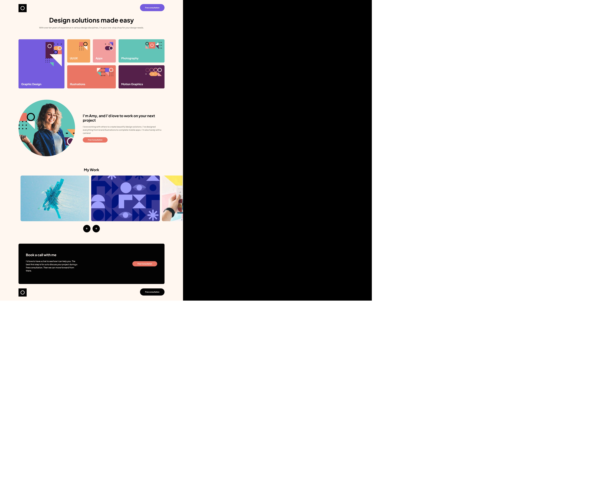

# Frontend Mentor - Single-page design portfolio solution

This is a solution to the [Single-page design portfolio challenge on Frontend Mentor](https://www.frontendmentor.io/challenges/singlepage-design-portfolio-2MMhyhfKVo). Frontend Mentor challenges help you improve your coding skills by building realistic projects. 

## Table of contents

- [Overview](#overview)
  - [The challenge](#the-challenge)
  - [Screenshot](#screenshot)
  - [Links](#links)
- [My process](#my-process)
  - [Built with](#built-with)
  - [What I learned](#what-i-learned)
  - [Continued development](#continued-development)
- [Author](#author)

## Overview

### The challenge

Users should be able to:

- View the optimal layout for the site depending on their device's screen size
- See hover states for all interactive elements on the page
- Navigate the slider using either their mouse/trackpad or keyboard

### Screenshot

### Links

- Solution URL: [My repo](https://github.com/dralveol/single-page-design)
- Live Site URL: [Live site](https://dralveol.github.io/single-page-design/)

## My process

### Built with

- Semantic HTML5 markup
- CSS custom properties
- Flexbox
- CSS Grid
- Mobile-first workflow
- SASS
- BEM

### What I learned

By diving into BEM, reading more about SASS, discovering libraries and what can be made with css. I feel like i'm starting to pass over the mountain of stupidity (Dunin Kruger Effect) and this is really good news.

I felt like the carousel part was really tricky. I don't know why if i don't set both html and body overflow to hidden. It just does not get hidden.

### Continued development

Design process +++++++.
More jQuery, SASS and BEM. Then move maybe to React.

## Author

- Frontend Mentor - [@dralveol](https://www.frontendmentor.io/profile/dralveol)